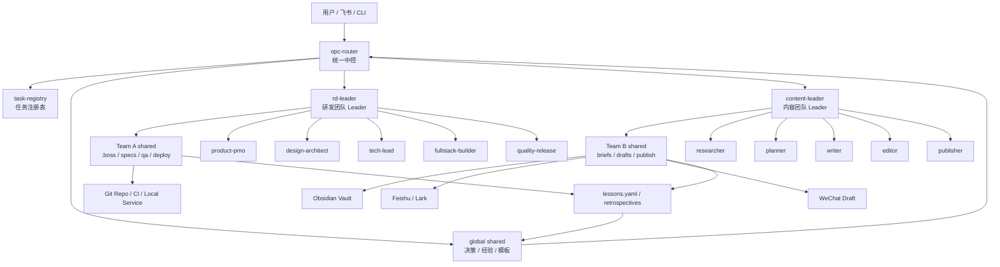

# AI 双团队中控方案：研发团队 A + 内容团队 B

> 目标：在本地 OpenClaw/QClaw、Codex、Obsidian、飞书 CLI 的基础上，搭建一个统一中控系统，把任务路由给研发团队 A 或内容团队 B，并让两个团队拥有独立 workspace、共享知识层、质量门禁和可持续自进化能力。

---

## 1. 设计结论

推荐采用 **统一中控 + 两个 Team Leader + 弹性 Specialist** 的结构。

```text
用户 / 飞书 / CLI / Codex
        |
        v
opc-router 统一中控
  - 任务分类：研发 / 内容 / 混合 / 运维
  - 创建 TaskSpec 和任务目录
  - 路由给 A 或 B 的 Leader
  - 管理状态、审批、复盘、经验沉淀
        |
        +--> Team A: openclaw-rd-team
        |      BMAD 研发流水线
        |
        +--> Team B: openclaw-content-team
               Obsidian LLM Wiki 内容流水线
```

核心判断：

- 中控只负责路由、状态、审批和归档，不直接做研发或写作。
- 每个团队控制在 `1 个 Leader + 5 个成员 Agent` 以内，避免角色过多导致协作成本失控。
- 研发团队 A 保留 PM、UI、Architect、Tech Lead、PMO、Frontend、Backend、QA、DevOps 等角色能力，但通过 5 个成员 Agent 承载多个 role mode。
- 内容团队 B 不做简单的“RAG 检索 + 写文章”，而是建立内容版 BMAD：选题、召回、策划、初稿、编辑、渠道适配、发布、复盘。
- 两个团队隔离 workspace，但通过全局 shared、Obsidian Wiki 和 lessons 机制沉淀成功与失败经验。

---

## 2. 现有基础

本方案基于以下现有资料和实现继续演进：

| 类型 | 路径 | 用途 |
| --- | --- | --- |
| 研发方案初稿 | `/Users/jerry/Documents/projects/the-way-to-opc/docs/OpenClaw-BMAD-多Agent研发流水线技术方案.md` | Team A 的 BMAD 流程、角色、工件契约和质量门禁底稿 |
| 团队编排 skill | `/Users/jerry/Documents/projects/the-way-to-opc/skill/agent-team-orchestration` | 多 Agent 团队的角色、生命周期、handoff、review 协议 |
| 团队创建 skill | `/Users/jerry/Documents/projects/the-way-to-opc/skill/multi-agent-builder` | OpenClaw 团队创建、workspace、角色文档、权限 profile |
| 内容团队项目包 | `/Users/jerry/Documents/projects/the-way-to-opc/projects/content-marketing-team` | Team B 的角色、阶段门禁、工件契约、复盘、runtime 绑定和既有内容 skill 复用协议 |
| 内容研究技能 | `/Users/jerry/Documents/projects/the-way-to-opc/skill/content-research` | 基于 Obsidian / LLM Wiki 的 evidence pack 和 research brief |
| 内容起草技能 | `/Users/jerry/Documents/projects/the-way-to-opc/skill/content-drafting` | 从 brief / outline 生成 Obsidian Markdown 初稿和终稿 |
| 多渠道发布技能 | `/Users/jerry/Documents/projects/the-way-to-opc/skill/content-publishing` | 将 reviewed draft 适配为飞书、公众号等渠道草稿和发布 handoff |
| Obsidian 知识库能力 | `obsidian-llm-wiki`、`wiki-query`、`wiki-ingest`、`wiki-lint` 等 | 知识检索、摄入、校验、维护和复盘沉淀 |
| 飞书能力 | `lark-doc`、`lark-drive`、`lark-wiki`、`lark-markdown` 等 | 飞书文档、知识库、文件和 Markdown 发布 |

---

## 3. 总体架构



三个层次：

| 层级 | 组件 | 职责 |
| --- | --- | --- |
| 控制层 | `opc-router` | 接收任务、分类、路由、状态管理、审批、汇总、复盘触发 |
| 团队层 | `rd-leader`、`content-leader` | 管理本队流程、派发 specialist、检查本队产物 |
| 执行层 | Team A/B specialist | 按角色产出专业工件、执行验证、写入 shared |

---

## 4. 中控设计

### 4.1 中控职责

`opc-router` 是全局控制平面，负责：

- 接收用户任务：飞书、CLI、Codex 对话、Obsidian 入口。
- 识别任务类型：`dev`、`content`、`hybrid`、`ops`。
- 创建标准任务对象 `TaskSpec`。
- 创建任务工作目录和事件日志。
- 路由给 Team A 或 Team B 的 Leader。
- 维护全局状态，不让子 Agent 自行决定最终完成状态。
- 管理人工审批点。
- 归档交付物、复盘和经验。
- 触发自进化流程。

中控不做的事：

- 不直接写业务代码。
- 不直接改文章正文。
- 不替代 Team Leader 做专业判断。
- 不绕过审批发布外部内容或生产部署。

### 4.2 路由规则

```yaml
routes:
  dev:
    target: openclaw-rd-team
    examples:
      - 开发功能
      - 修 bug
      - 重构
      - 写接口
      - 前端页面
      - 后端服务
      - 测试
      - 部署

  content:
    target: openclaw-content-team
    examples:
      - 写文章
      - 整理文档
      - 公众号
      - 飞书文档
      - Obsidian 知识库
      - 选题
      - 初稿

  hybrid:
    target: team_a_then_b
    examples:
      - 为新功能写产品文档
      - 把研发方案写成对外文章
      - 生成技术白皮书
      - 发布说明
      - 研发复盘文章

  ops:
    target: opc-router
    examples:
      - 查看状态
      - 审批
      - 复盘
      - 重试失败任务
      - 查看经验库
```

混合任务默认先由 Team A 产出事实、代码、技术上下文，再由 Team B 做表达、传播和渠道适配。

### 4.3 TaskSpec

所有输入先归一化为 `TaskSpec`：

```yaml
id: task-20260517-001
title: 基于 Obsidian 写一篇 AI 数字员工公众号文章
type: content
priority: normal
target_team: openclaw-content-team
owner: opc-router
status: created
created_at: "2026-05-17T00:00:00+08:00"
updated_at: "2026-05-17T00:00:00+08:00"

inputs:
  topic: AI 数字员工落地方案
  audience: 电商商家 / 产品负责人
  channels:
    - obsidian
    - feishu
    - wechat
  source_policy: local_wiki_first

context_sources:
  - obsidian://llm-wiki
  - repo://current
  - web://optional_when_current_facts_required

approval_gates:
  - outline_review
  - final_review
  - publish_review

outputs:
  - brief
  - draft
  - final
  - publish_log

artifact_root: /Users/jerry/.qclaw/teams/openclaw-content-team/shared/tasks/task-20260517-001
```

### 4.4 状态机

统一状态机：

```text
created
  -> classified
  -> assigned
  -> planning
  -> in_progress
  -> review
  -> waiting_approval
  -> approved
  -> delivery
  -> completed
```

失败与暂停分支：

```text
blocked -> waiting_user -> in_progress
failed -> retrying -> in_progress
failed -> archived
cancelled
```

状态更新原则：

- 中控拥有全局状态最终写入权。
- Team Leader 拥有本队子状态写入权。
- Specialist 只能提交 handoff，不直接把任务标记为 completed。
- 每次状态转换必须写事件日志。

---

## 5. Workspace 与隔离

建议运行时目录：

```text
/Users/jerry/.qclaw/teams/
├── opc-router/
│   ├── SOUL.md
│   ├── AGENTS.md
│   ├── router.yaml
│   ├── task-schema.yaml
│   ├── logs/
│   └── state/
├── openclaw-rd-team/
│   ├── rd-leader/
│   ├── product-pmo/
│   ├── design-architect/
│   ├── tech-lead/
│   ├── fullstack-builder/
│   ├── quality-release/
│   └── shared/
│       ├── tasks/
│       ├── specs/
│       ├── architecture/
│       ├── implementation/
│       ├── qa/
│       ├── deploy/
│       ├── reviews/
│       ├── decisions/
│       └── lessons/
├── openclaw-content-team/
│   ├── content-leader/
│   ├── researcher/
│   ├── planner/
│   ├── writer/
│   ├── editor/
│   ├── publisher/
│   └── shared/
│       ├── tasks/
│       ├── briefs/
│       ├── source-packs/
│       ├── outlines/
│       ├── drafts/
│       ├── reviews/
│       ├── publish/
│       ├── decisions/
│       └── lessons/
└── shared/
    ├── task-registry/
    ├── playbooks/
    ├── decisions/
    ├── retrospectives/
    ├── lessons/
    ├── skill-patch-proposals/
    └── metrics/
```

隔离规则：

- 每个 Agent 可自由读写自己的 workspace。
- 专业交付物必须写入本队 `shared/`，不能只留在个人 workspace。
- 跨团队共享只通过全局 `shared/`、Obsidian Wiki 或明确的任务 artifact。
- 中控可以读取所有 shared 和状态文件，但不修改专业产物正文。
- 外部发布、生产部署、凭证使用必须经过审批。

---

## 6. Team A：研发团队

### 6.1 定位

Team A 是基于 BMAD 方法论的自动化研发流水线，覆盖从需求到部署的软件开发生命周期。

它复用现有研发方案中的核心工件：

```text
.boss/<feature>/
├── pipeline-status.yaml
├── prd.md
├── architecture.md
├── ui-spec.md
├── tech-review.md
├── tasks.md
├── qa-report.md
└── deploy-report.md
```

### 6.2 团队编制

采用 `1 个 Leader + 5 个成员 Agent`：

| Agent | 覆盖角色 | 核心职责 | 主要产物 |
| --- | --- | --- | --- |
| `rd-leader` | BMAD Orchestrator | 接收中控任务、选择流程、维护本队状态、执行 gate、汇总交付 | `pipeline-status.yaml`、交付摘要 |
| `product-pmo` | PM、PMO | 需求澄清、PRD、用户故事、验收标准、任务计划 | `prd.md`、`tasks.md` |
| `design-architect` | UI、Architect | UI/UX、系统架构、技术选型、API、数据模型 | `ui-spec.md`、`architecture.md` |
| `tech-lead` | Tech Lead | 技术评审、风险、代码规范、实现策略、review gate | `tech-review.md`、review 反馈 |
| `fullstack-builder` | Frontend、Backend | 调用 Codex 执行开发、测试、修复、提交变更说明 | 代码变更、测试、实现 handoff |
| `quality-release` | QA、DevOps | 单测/集成/E2E、构建、健康检查、部署计划、回滚方案 | `qa-report.md`、`deploy-report.md` |

说明：这些是常驻 seat，不代表角色能力减少。复杂任务中，`rd-leader` 可以临时 spawn 更细粒度的 frontend、backend、qa 或 devops 子任务，但默认团队编制保持轻量。

### 6.3 研发流程

```text
用户需求
  -> opc-router 分类为 dev
  -> rd-leader 初始化 .boss/<feature>/
  -> product-pmo 产出 PRD 和验收标准
  -> design-architect 产出架构和 UI 规范
  -> tech-lead 产出技术评审
  -> product-pmo 产出任务拆解
  -> fullstack-builder 调用 Codex 实现
  -> quality-release 运行测试、构建、健康检查
  -> rd-leader 汇总交付
  -> opc-router 归档、复盘、沉淀经验
```

### 6.4 研发质量门禁

| Gate | 自动检查 | 人工审批 |
| --- | --- | --- |
| PRD Gate | `prd.md` 存在，包含验收标准和非目标范围 | PRD 审批 |
| Architecture Gate | 架构、API、数据、风险完整 | 架构审批 |
| Task Gate | `tasks.md` 包含任务 ID、依赖、验收测试 | 可选 |
| Test Gate | 真实运行测试命令并记录结果 | 失败修复后再审 |
| Build Gate | 生产构建或本地启动成功 | 可选 |
| Deploy Gate | 健康检查、停止方式、回滚方案完整 | 部署审批 |

原则：Prompt 约束不能作为最终 gate，关键 gate 必须能通过脚本、文件契约或真实命令验证。

---

## 7. Team B：内容团队

### 7.1 定位

Team B 是基于 Obsidian LLM Wiki 的内容生产流水线，目标是把本地知识库转化为高质量文档、飞书知识内容和微信公众号草稿。

它的主线不是“一次性写作”，而是：

```text
主题输入
  -> 本地知识召回
  -> 观点和结构策划
  -> Obsidian 主稿
  -> 人机协同编辑
  -> 渠道适配
  -> 发布记录
  -> 复盘回写
```

### 7.2 团队编制

采用 `1 个 Leader + 5 个成员 Agent`：

| Agent | 覆盖角色 | 核心职责 | 主要产物 |
| --- | --- | --- | --- |
| `content-leader` | Editor-in-Chief、Producer | 接收内容任务、判断内容类型、安排流程、控制质量、管理发布节奏 | 内容状态、交付摘要 |
| `researcher` | Knowledge Curator | 检索 Obsidian Wiki、整理 source pack、识别知识缺口、必要时外部核验 | `source-pack.md`、`research-brief.md` |
| `planner` | Content Strategist | 明确读者、立场、标题、论点、结构、传播角度 | `outline.md`、`title-options.md` |
| `writer` | Draft Writer | 根据 brief 和 outline 生成 Obsidian Markdown 初稿 | `draft.md` |
| `editor` | Editor、Fact-checker | 编辑结构、事实核查、删除空话、补强论证、处理 `[verify]` | `editor-review.md`、`final.md` |
| `publisher` | Channel Publisher | 飞书、公众号等渠道适配，生成草稿或发布记录 | `feishu.md`、`wechat.html`、`publish-log.md` |

### 7.3 内容流水线

```text
文章主题 / 大致思路
  -> content-leader 创建任务目录
  -> researcher 使用 content-research 召回知识
  -> planner 使用 content-planning 生成内容 brief、标题和大纲
  -> writer 使用 content-drafting 生成 Obsidian 初稿
  -> editor 做事实、结构、风格和引用 review
  -> 用户审批最终稿
  -> publisher 使用 content-publishing 适配飞书 / 微信草稿
  -> content-leader 复盘并回写 lessons
```

### 7.4 内容工件契约

建议每篇内容一个任务目录：

```text
writing/tasks/<task-id>-<slug>/
├── 00-task.md
├── 01-research-brief.md
├── 02-source-pack.md
├── 03-outline.md
├── 04-draft.md
├── 05-editor-review.md
├── 06-final.md
├── 07-feishu.md
├── 08-wechat.html
├── 09-publish-log.md
└── 10-retrospective.md
```

如果写入 Obsidian Vault，则默认使用当前 `content-drafting` 约定：

```text
<wiki-root>/writing/briefs/YYYY-MM-DD-slug.md
<wiki-root>/writing/drafts/YYYY-MM-DD-slug.md
```

`draft.md` frontmatter 建议：

```yaml
title: ""
status: draft
topic: ""
audience: ""
target_channels:
  - feishu
  - wechat
source_policy: local_wiki_first
created_at: "2026-05-17T00:00:00+08:00"
updated_at: "2026-05-17T00:00:00+08:00"
published: {}
```

### 7.5 内容质量门禁

| Gate | 自动检查 | 人工审批 |
| --- | --- | --- |
| Source Gate | central claim 有 source path、URL 或 `[verify]` | 可选 |
| Outline Gate | 有目标读者、核心论点、结构、标题候选 | 大纲审批 |
| Draft Gate | 正文完整，未隐藏不确定性 | 可选 |
| Fact Gate | 无 unresolved `[verify]`，或明确用户允许保留 | 最终稿审批 |
| Publish Gate | frontmatter `status` 为 `reviewed` 或 `ready_to_publish` | 外部发布审批 |

发布策略：

- 飞书：可以自动创建/更新草稿文档。
- 微信公众号：第一阶段只生成 HTML/Markdown 或草稿箱内容，不自动群发。
- 任何外部发布都必须有人工确认。

---

## 8. 信息共享与隔离

### 8.1 共享对象

| 对象 | 位置 | 说明 |
| --- | --- | --- |
| 任务注册表 | `opc-router/state/` 或全局 `shared/task-registry/` | 全局唯一任务状态 |
| 研发工件 | Team A `shared/tasks/<task-id>/` 或项目 `.boss/<feature>/` | PRD、架构、任务、测试、部署 |
| 内容工件 | Team B `shared/tasks/<task-id>/` 或 Obsidian `writing/` | brief、draft、final、publish log |
| 决策 | 全局和团队 `decisions/` | 架构、产品、内容定位等关键决策 |
| 复盘 | 全局和团队 `retrospectives/` | 每个任务结束后的事实复盘 |
| 经验 | 全局和团队 `lessons/` | 可复用成功/失败模式 |
| Playbook | 全局 `playbooks/` | 晋升后的稳定流程 |
| 团队知识库 Vault | `/Users/jerry/Documents/knowledge/team-knowledge/opc-wiki` | 团队共享知识、内容素材、最终文稿和可查询 wiki |
| 共享记忆 Vault | `/Users/jerry/Documents/knowledge/team-knowledge/opc-memory` | 任务记忆、经验候选、团队记忆和 playbook 的 Obsidian 视图 |

### 8.2 隔离原则

- Team A 可以读取内容团队公开交付物，但不能改内容正文。
- Team B 可以读取研发团队交付摘要、PRD、架构、发布说明，但不能改业务代码。
- 中控可以聚合状态，但不能在没有团队 handoff 的情况下直接改专业产物。
- 密钥、token、cookie、生产环境配置不能进入 Obsidian、Git 或 task artifact。

### 8.3 Obsidian 共享记忆层

共享记忆层采用 Obsidian-compatible Markdown 文件，而不是在 `opc-router` 内部硬编码长期记忆数据库。

默认位置：

```text
/Users/jerry/Documents/knowledge/team-knowledge/opc-memory/
├── AGENTS.md
├── TODO.md
├── agents/
├── decisions/
├── lessons/
├── people/
├── playbooks/
├── projects/
├── runs/
└── teams/
```

也可以通过 `OPC_MEMORY_ROOT` 或 `--memory-root` 指向其他 Obsidian Vault 中的独立目录。

写入规则：

- `runs/<task-id>.md` 保存任务级事实、状态、产物和复盘快照。
- `lessons/<task-id>.md` 保存从 `lessons.yaml` 提取的 L1 经验候选。
- `teams/<team>.md` 只保存团队级稳定记忆入口和晋升规则。
- `playbooks/` 只接收经过复盘、聚类和审核后的稳定流程。
- `AGENTS.md` 写明记忆规则，禁止保存密钥、cookie、个人隐私和生产凭证。

同步命令：

```bash
opc memory sync <task-id> --memory-root /Users/jerry/Documents/knowledge/team-knowledge/opc-memory
```

如果不传 `--memory-root`，默认写入 `/Users/jerry/Documents/knowledge/team-knowledge/opc-memory`。

重要边界：`opc memory sync` 是幂等的文件导出命令，不负责 heartbeat、定时任务、自动唤醒或周期扫描。宿主环境如 OpenClaw 已有 heartbeat 时，只需要在合适的节点调用这个命令。

---

## 9. 自进化机制

目标：让团队从成功和失败中积累能力，而不是每次重新开始。

### 9.1 每个任务必须留下的记录

```text
task-summary.md
event-log.jsonl
retrospective.md
lessons.yaml
failure-modes.md
skill-patch-proposals.md
```

### 9.2 lessons.yaml 格式

```yaml
task_id: task-20260517-001
team: openclaw-content-team
outcome: success
created_at: "2026-05-17T00:00:00+08:00"

signals:
  task_type: content
  duration_minutes: 42
  retries: 1
  approvals:
    outline_review: passed
    final_review: passed
    publish_review: skipped

what_worked:
  - "先生成 research brief 再写 draft，降低了无来源观点。"

what_failed:
  - "第一次 source pack 混入了无 provenance 的旧笔记。"

root_causes:
  - "researcher 没有区分 source page 和 synthesis page。"

candidate_rules:
  - "核心事实优先引用 raw/source page；synthesis page 只能作为上下文。"

promotion:
  status: proposed
  target:
    - skill/content-research/SKILL.md
    - content-team/MEMORY.md
```

### 9.3 经验晋升规则

经验分四级：

| 级别 | 载体 | 晋升条件 |
| --- | --- | --- |
| L0 临时记录 | `event-log.jsonl` | 任务过程自动生成 |
| L1 复盘经验 | `lessons.yaml` | 任务完成或失败后生成 |
| L2 团队记忆 | `MEMORY.md` / `playbooks/` | 同类任务出现 2 次以上，且结论稳定 |
| L3 Skill 更新 | `SKILL.md` / scripts / tests | 有明确失败案例或成功增益，并通过回归验证 |

禁止事项：

- 不因一次偏好就修改长期规则。
- 不把未经验证的猜测写入 Skill。
- 不把失败记录删除或覆盖。
- 不让同一个 Agent 独自批准自己提出的 skill patch。

### 9.4 自进化流程

```text
任务执行
  -> Team Leader 生成 retrospective
  -> 中控提取 lessons.yaml
  -> opc memory sync 写入 Obsidian-compatible shared memory
  -> 聚合同类 lessons
  -> 生成 skill-patch-proposal
  -> 人工或 reviewer 审核
  -> 小样本回归验证
  -> 晋升到 MEMORY.md / SKILL.md / gate script
```

这套机制参考 Hermes history ingest 的思想：保留 durable knowledge，不保存低价值流水账；对会话、记忆和任务过程做提炼、聚类、去重和归档。

---

## 10. 推荐 Skill 组合

### 10.1 中控

```text
agent-team-orchestration
multi-agent-builder
impl-validator
wiki-capture
wiki-update
memory-bridge
```

### 10.2 研发 Team A

```text
bmad-pipeline
repo-analyzer
api-spec-generator
ci-debugger
code-review
qa-report
release-checklist
github:gh-fix-ci
github:gh-address-comments
```

Team A 当前可先复用：

```text
/Users/jerry/Documents/projects/the-way-to-opc/skill/agent-team-orchestration
/Users/jerry/Documents/projects/the-way-to-opc/skill/multi-agent-builder
/Users/jerry/Documents/projects/the-way-to-opc/docs/OpenClaw-BMAD-多Agent研发流水线技术方案.md
```

### 10.3 内容 Team B

```text
openclaw-content-team
content-research
content-planning
content-drafting
content-publishing
content-memory
skill-evolution
obsidian-llm-wiki
wiki-query
wiki-ingest
wiki-lint
tag-taxonomy
cross-linker
wiki-digest
lark-doc
lark-drive
lark-wiki
lark-markdown
```

Team B 当前采用“编排 skill + 专业 skill”结构：

- `projects/content-marketing-team` 是内容团队项目包，负责团队角色、阶段门禁、handoff、工件契约、复盘、runtime 绑定和 lessons。
- `skill/content-research`、`skill/content-planning`、`skill/content-drafting`、`skill/content-publishing`、`skill/content-memory`、`skill/skill-evolution` 分别负责可复用的专业能力。
- `projects/content-marketing-team/.codex/skills`、`.claude/skills`、`.openclaw/skills`、`.trae/skills` 通过链接暴露这些通用 skill，便于 Codex、Claude、OpenClaw、Trae 等 runtime 使用。
- `opc-router` 仍拥有任务状态、审批和 completed 写入权，skill 不绕过中控直接发布或完成任务。

内容团队项目包已拆成可渐进加载结构：

```text
projects/content-marketing-team/
├── SKILL.md
├── SETUP.md
├── references/
│   ├── workflow.md
│   ├── artifact-contract.md
│   ├── quality-gates.md
│   └── channel-drafts.md
└── assets/templates/
    ├── publish-plan.md
    └── publish-log.md
```

通用专业 skill 位于：

```text
skill/content-research/
skill/content-planning/
skill/content-drafting/
skill/content-publishing/
skill/content-memory/
skill/skill-evolution/
```

外部社区 skill 只作为候选，不直接进入生产链路。候选 skill 必须经历：

```text
下载到 candidate-skills/
  -> 代码审查
  -> 脚本审查
  -> 最小权限配置
  -> 3-5 个真实任务试跑
  -> 通过后再安装到正式 skills/
```

---

## 11. 命令入口设计

第一版可以只实现文本命令，不做 UI。

```bash
opc new "开发一个支持登录的 Todo Web App"
opc new "基于 Obsidian 写一篇 AI 数字员工公众号文章"
opc status task-20260517-001
opc approve task-20260517-001 outline_review
opc retry task-20260517-001
opc retrospective task-20260517-001
opc lessons list --team content
opc memory sync task-20260517-001
```

也可以保留更短的别名：

```bash
opc dev "修复 xxx bug，并生成测试报告"
opc content "写一篇关于 AI Coding 的飞书文档"
opc publish task-20260517-001 feishu
opc memory sync task-20260517-001 --memory-root /Users/jerry/Documents/knowledge/team-knowledge/opc-memory
```

宿主 heartbeat 集成时推荐调用这些幂等入口：

```bash
opc list
opc status <task-id>
opc run <task-id>
opc publish <task-id> --channel feishu
opc memory sync <task-id>
```

`opc-router` 不内置 heartbeat 调度；定时、唤醒、重试窗口和后台轮询由 OpenClaw 等宿主环境管理。

---

## 12. 技术选型

第一版建议保持轻量：

| 组件 | 推荐 |
| --- | --- |
| 中控 | TypeScript CLI 或 Python CLI |
| Agent runtime | OpenClaw/QClaw |
| 研发执行 | Codex + BMAD 工件契约 + Git worktree |
| 内容执行 | Codex + Obsidian LLM Wiki + 本地 Markdown |
| 飞书 | lark CLI / lark skills |
| 微信 | Markdown/HTML 到草稿箱，人工发布 |
| 状态 | Markdown/YAML + JSONL，必要时再引入 SQLite |
| 产物 | Team shared + Git repo + Obsidian Vault |
| 质量门禁 | 文件契约 + 脚本校验 + 真实命令 |

暂不建议一开始引入复杂状态机框架。等任务并发、重试、可视化需求稳定后，再考虑 LangGraph 或独立服务化中控。

---

## 13. 安全与权限

### 13.1 发布安全

内容团队默认只能生成草稿：

```text
允许：Obsidian draft、飞书草稿、微信公众号草稿箱
禁止：未经审批直接外部发布
```

### 13.2 部署安全

研发团队默认只能执行本地或 staging：

```text
允许：本地启动、测试、staging 部署计划
禁止：未经审批直接生产部署
```

### 13.3 密钥安全

以下内容禁止写入 Git、Obsidian、task artifact：

```text
API Key
token
cookie
生产环境密码
个人隐私凭证
```

存放位置：

```text
.env
本地环境变量
1Password / 密钥管理器
CI Secret
```

### 13.4 第三方 Skill 安全

第三方 skill 必须：

```text
固定版本
代码审查
脚本审查
最小权限
沙箱试跑
记录来源
可回滚
```

---

## 14. MVP 落地路径

### P0：确认运行目录和命名

确认：

```text
中控：opc-router
研发团队：openclaw-rd-team
内容团队：openclaw-content-team
运行目录：/Users/jerry/.qclaw/teams/
```

验收：

- 命名固定。
- workspace 结构确认。
- 外部入口只绑定中控。

### P1：创建中控任务模型

实现：

- `TaskSpec`
- `router.yaml`
- `task-registry`
- `event-log.jsonl`
- `status` / `approve` / `retry` 命令或等价手动流程。

验收：

- 任意输入能被分类为 dev/content/hybrid。
- 每个任务都有唯一目录和状态文件。

### P2：先跑通内容团队 B

原因：内容链路最容易形成可见闭环，且 `openclaw-content-team` 已将研究、规划、起草、发布、记忆和 skill 进化拆成子技能。

样例：

```bash
opc content "基于我的 Obsidian 知识库，写一篇关于 AI Coding 的飞书文档"
```

验收：

- 生成 research brief。
- 生成 Obsidian draft。
- 通过 editor review。
- 生成飞书草稿或可同步 Markdown。
- 生成 retrospective 和 lessons。

### P3：接入研发团队 A

实现：

- 复用 `.boss/<feature>/` 工件目录。
- 创建 Team A 的 6 个 Agent。
- 跑一个小型 Web 工具或 bugfix。

验收：

- 生成 PRD、架构、任务拆解。
- Codex 完成代码改动。
- QA 真实运行测试。
- 生成 qa-report 和 deploy-report。

### P4：打通 A+B 混合任务

样例：

```bash
opc new "把 OpenClaw BMAD 研发流水线方案整理成一篇飞书技术文章"
```

流程：

```text
Team A 提供技术事实和研发工件
  -> Team B 生成文章 brief 和 draft
  -> 用户审批
  -> 发布到飞书草稿
```

验收：

- A/B artifact 可互相引用。
- 中控能追踪跨团队状态。
- 复盘能沉淀到全局 lessons。

### P5：自进化闭环

实现：

- 每个任务生成 `lessons.yaml`。
- 周期性聚合同类 lessons。
- 生成 skill patch proposal。
- 通过 review 和测试后再更新 skill。

验收：

- 至少一个失败案例被转化为 gate 或 skill 规则。
- 至少一个成功流程被转化为 playbook。

---

## 15. 使用说明

### 15.1 研发任务

输入：

```bash
opc dev "开发一个支持登录、列表和搜索的 Todo Web App"
```

预期输出：

```text
Team A shared/tasks/<task-id>/
├── pipeline-status.yaml
├── prd.md
├── architecture.md
├── ui-spec.md
├── tech-review.md
├── tasks.md
├── qa-report.md
├── deploy-report.md
├── retrospective.md
└── lessons.yaml
```

### 15.2 内容任务

输入：

```bash
opc content "基于 Obsidian 知识库，写一篇关于 AI Agent Harness 的公众号文章"
```

可选输入：

```bash
opc content "基于 Obsidian 知识库，写一篇关于 AI Agent Harness 的公众号文章" \
  --audience "产品负责人" \
  --channel feishu,wechat \
  --publish-destination feishu:team-wiki,wechat:manual \
  --wiki-root /Users/jerry/Documents/knowledge/team-knowledge/opc-wiki
```

当前已落地的本地闭环采用“中控生成 stage packet / skill handoff，Agent 按 skill 产出工件，中控再推进 gate”的方式执行：

```bash
# 1. 创建内容任务
opc content "基于 Obsidian 知识库，写一篇关于 AI Agent Harness 的公众号文章"

# 2. 生成 research 阶段包和 skill handoff
opc run <task-id> --wiki-root /Users/jerry/Documents/knowledge/team-knowledge/opc-wiki --execute-skill

# 2.1 Codex / OpenClaw 读取 skill-handoff.md，使用 content-research 写入：
# 01-evidence-pack.md、02-outline.md、03-review-checklist.md

# 3. 审批大纲后生成初稿和初稿审核
opc approve <task-id> outline_review
opc run <task-id> --wiki-root /Users/jerry/Documents/knowledge/team-knowledge/opc-wiki --execute-skill

# 3.1 Agent 使用 content-drafting 写入：
# 04-draft.md、05-draft-review.md

# 4. 审批终稿后生成 final、retrospective、lessons，写回 Obsidian，并进入 publish_review
opc approve <task-id> final_review
opc run <task-id> --wiki-root /Users/jerry/Documents/knowledge/team-knowledge/opc-wiki --execute-skill

# 4.1 Agent 使用 content-drafting 写入：
# 06-final.md、07-retrospective.md、08-publish-plan.md、lessons.yaml

# 4.2 中控检查 final 工件后写回 Obsidian，并进入 publish_review
opc run <task-id> --wiki-root /Users/jerry/Documents/knowledge/team-knowledge/opc-wiki

# 5. 审批发布准备后生成本地渠道草稿、publish manifest、publisher handoff 和 publish log，并完成本地任务
opc approve <task-id> publish_review
opc run <task-id> --wiki-root /Users/jerry/Documents/knowledge/team-knowledge/opc-wiki --execute-skill

# 5.1 Agent 使用 content-publishing 写入渠道草稿、publish manifest、publisher handoff 和 publish log

# 5.2 中控检查发布工件后完成本地任务
opc run <task-id> --wiki-root /Users/jerry/Documents/knowledge/team-knowledge/opc-wiki

# 6. 发布 dry-run 就绪检查，不产生外部副作用
opc publish <task-id> --channel feishu

# 7. 同步任务记忆到 Obsidian-compatible shared memory
opc memory sync <task-id> --memory-root /Users/jerry/Documents/knowledge/team-knowledge/opc-memory
```

当前 P2-E 预期输出：

```text
Team B shared/tasks/<task-id>/
├── stage-packet.json
├── stage-instructions.md
├── skill-execution-request.json
├── skill-handoff.md
├── 01-evidence-pack.md
├── 02-outline.md
├── 03-review-checklist.md
├── 04-draft.md
├── 05-draft-review.md
├── 06-final.md
├── 07-retrospective.md
├── 08-publish-plan.md
├── 09-publish-log.md
├── 10-feishu-draft.md
├── 11-wechat-draft.md
├── 12-publisher-handoff.md
├── 13-publish-readiness-report.md
├── 14-memory-update.md
├── memory-patch.json
├── publish-manifest.json
├── event-log.jsonl
├── task.json
└── lessons.yaml
```

同时写回 Obsidian：

```text
<wiki-root>/writing/finals/YYYY-MM-DD-slug.md
```

飞书/微信公众号真实草稿同步仍属于下一阶段；当前只生成本地渠道草稿包、发布 manifest 和 `content-publishing` handoff，不自动产生外部副作用。

`opc publish` 当前默认执行 dry-run，就绪检查通过后只写入 `13-publish-readiness-report.md`。真实外部发布必须等 adapter 配置完成后显式使用执行模式；未实现 adapter 时，`--execute` 会拒绝执行。

`opc memory sync` 当前会写入任务侧 `14-memory-update.md`、`memory-patch.json`，并在共享记忆 Vault 中生成 `runs/<task-id>.md`、`lessons/<task-id>.md`、`teams/openclaw-content-team.md` 等文件。这一步可以由用户手动触发，也可以由宿主 OpenClaw heartbeat 在任务完成或失败后触发。

### 15.3 混合任务

输入：

```bash
opc new "为刚完成的功能写一篇发布说明，并同步到飞书"
```

预期流程：

```text
Team A 汇总功能事实、变更点、测试结果
  -> Team B 生成发布说明
  -> 用户审批
  -> publisher 同步飞书草稿
```

---

## 16. 最终建议

项目可以命名为：

```text
AI Operating Desk
```

也可以更贴近 OpenClaw 命名：

```text
OpenClaw Operating Desk
```

最推荐的启动顺序：

```text
1. 固定中控、团队和 workspace 命名
2. 建 TaskSpec 和路由规则
3. 跑通内容团队 B
4. 接入研发团队 A
5. 打通 A+B 混合任务
6. 建立 lessons -> playbook -> skill patch 的自进化闭环
```

核心原则：

1. 中控掌握最终状态，Leader 掌握本队流程，specialist 只负责专业交付。
2. 团队 workspace 隔离，交付物进入 shared，跨团队共享必须显式。
3. 研发团队用 BMAD 保证纪律，Codex 负责实现和验证。
4. 内容团队以 Obsidian LLM Wiki 为 source-of-truth，主稿先在本地沉淀。
5. 飞书和微信公众号第一阶段只做草稿或同步，不做无审批自动发布。
6. 自进化必须基于真实成功和失败，经验先复盘，再晋升为 playbook 或 skill。

---

## 17. 参考资料

- BMAD Method: https://github.com/bmadcode/BMAD-METHOD
- BMAD Docs: https://docs.bmad-method.org/
- Karpathy LLM Wiki: https://gist.github.com/karpathy/442a6bf555914893e9891c11519de94f
- OpenAI Codex CLI: https://developers.openai.com/codex/cli
- OpenAI AGENTS.md: https://developers.openai.com/codex/guides/agents-md
- OpenAI Agents orchestration: https://developers.openai.com/api/docs/guides/agents/orchestration
- LangChain Multi-agent: https://docs.langchain.com/oss/python/langchain/multi-agent
- Obsidian Local REST API: https://github.com/coddingtonbear/obsidian-local-rest-api
- Obsidian MCP Server: https://github.com/cyanheads/obsidian-mcp-server
- 飞书 CLI: https://github.com/larksuite/cli
- Feishu Markdown: https://github.com/huandu/feishu-markdown
- Awesome Claude Code: https://github.com/hesreallyhim/awesome-claude-code
- Memento-Skills: https://arxiv.org/abs/2603.18743
