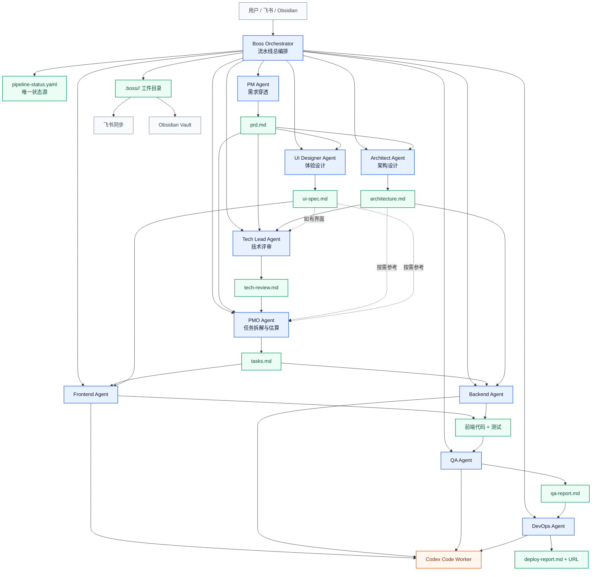
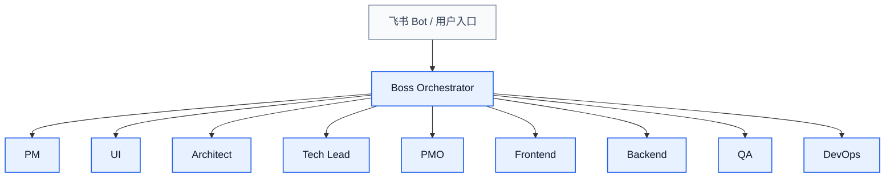

# OpenClaw + BMAD 多 Agent 研发流水线技术方案

## 1. 背景与目标

目标是在本地 QClaw/OpenClaw、Codex、飞书 CLI、Obsidian 的基础上，搭建一个基于 BMAD 方法论的多 Agent 自动研发流水线。系统需要模拟完整研发团队，从需求进入、产品分析、架构设计、任务拆解、前后端开发、测试验证，到部署交付形成闭环。

本方案采用混合架构：

- BMAD 流程模板作为方法论内核，定义阶段、角色、输入输出和质量门禁。
- QClaw/OpenClaw 作为真实多 Agent 运行时，负责 Agent 隔离、会话、子 Agent 调度、工具权限和状态管理。
- Codex 作为强代码执行 Agent，承担复杂代码分析、实现、测试修复和代码审查。
- 飞书用于协作发布和阶段汇报，Obsidian 用于长期知识沉淀。

## 2. 设计结论

最终技术路线是：以 BMAD 流程和工件契约作为研发方法论内核，以 OpenClaw/QClaw 作为多 Agent 运行时，把流程、角色、状态机、质量门禁和交付同步统一到一条可恢复、可审计的自动研发流水线中。

| 组件 | 定位 | 说明 |
| --- | --- | --- |
| BMAD 流程模板 | 流程内核 | 提供四阶段研发流程、角色职责、文档模板、质量门禁规则 |
| OpenClaw/QClaw | 运行时底座 | 提供真实 Agent、workspace、sessions、subagents、工具权限 |
| Boss Orchestrator | 总编排层 | 负责流水线控制、状态机、任务派发、gate 和交付汇总 |
| PMO Agent | 敏捷教练 | 基于 `prd.md` + `tech-review.md` 做任务拆解、工作量估算和测试用例定义 |
| Codex | 代码执行 Agent | 用于实现、测试、修复、审查、复杂代码库分析 |
| `.boss/<feature>/` | 工件仓库 | 保存 PRD、架构、任务、测试报告、部署报告和状态文件 |
| 飞书 | 协作界面 | 生成阶段摘要、同步交付文档 |
| Obsidian | 知识库 | 保存方案、ADR、复盘、经验沉淀 |

## 3. 总体架构



## 4. 角色设计

### 4.1 角色职责矩阵

下表定义所有运行时 Agent 的职责、输入输出和执行边界。

| Agent | 角色定位 | 核心能力 | 输入 | 输出 | OpenClaw 运行要求 |
| --- | --- | --- | --- | --- | --- |
| `boss-orchestrator` | 编排层 Agent | 流水线控制、状态机、Agent 派发、质量 gate、交付汇总 | 用户原始需求、`.boss/<feature>/pipeline-status.yaml`、所有阶段产物 | `pipeline-status.yaml`、阶段派发记录、最终交付摘要 | 不直接写业务代码；只调度、检查、汇总 |
| `pm` | 20 年产品经验，受乔布斯/张小龙认可 | 需求穿透、4 层需求挖掘、用户故事、验收标准 | 用户原始需求、业务背景、可选竞品调研 | `prd.md` | 可使用搜索；必须输出可验收需求 |
| `ui` | Apple 20 年设计师 | 像素级设计、前端友好规范、设计系统、组件状态、无障碍 | `prd.md` | `ui-spec.md` | 仅在有 UI/UX 需求时执行；输出应可直接指导前端实现 |
| `architect` | 系统架构师 | 架构设计、技术选型、API 设计、数据模型、安全与部署架构 | `prd.md`、现有代码结构、技术约束 | `architecture.md` | 必须先调研再设计；输出要覆盖前端、后端、数据、基础设施 |
| `tech-lead` | 技术负责人 | 技术评审、风险评估、可行性分析、代码规范、实施建议 | `prd.md` + `architecture.md` + 可选 `ui-spec.md` | `tech-review.md` | 不负责拆任务；只给技术评审结论和阻塞项 |
| `pmo` | 敏捷教练 | 任务拆解、工作量估算、依赖识别、测试用例定义、执行顺序规划 | `prd.md` + `tech-review.md` + 可选 `ui-spec.md`、`architecture.md` | `tasks.md` | 不做总编排；只负责可执行任务计划 |
| `frontend` | 前端专家 | UI 实现、组件开发、状态管理、前端测试、性能优化 | `tasks.md` + `ui-spec.md` + 相关架构约束 | 前端代码、前端单元/集成/E2E 测试 | 可调用 Codex；只修改前端职责范围 |
| `backend` | 后端专家 | API 开发、数据库、业务逻辑、安全校验、后端测试 | `tasks.md` + `architecture.md` + API/数据规范 | 后端代码、API 测试、数据库迁移 | 可调用 Codex；只修改后端职责范围 |
| `qa` | 测试工程师 | 测试执行、质量验证、缺陷报告、回归验证、安全/性能检查 | 代码 + `prd.md` + `tasks.md` + 部署地址 | `qa-report.md` | 必须运行真实测试命令；不能只写结论 |
| `devops` | 运维工程师 | 构建部署、环境配置、服务启动、健康检查、回滚建议 | 代码 + `qa-report.md` + `architecture.md` | `deploy-report.md` + 可访问 URL | 部署前必须确认 QA gate；危险操作走审批 |

### 4.2 控制权边界

| 层级 | 控制对象 | 可做 | 不可做 |
| --- | --- | --- | --- |
| Boss Orchestrator | 整条流水线 | 初始化工件目录、派发 Agent、更新状态、执行 gate、决定回退或推进 | 直接写业务代码、跳过 gate、替专业 Agent 产出核心文档 |
| PMO | 任务管理 | 将 PRD 和技术评审拆成任务、估算工作量、定义验收测试、识别依赖 | 代替 Boss 调度全流程、代替 Tech Lead 做架构评审 |
| 专业 Agent | 各自专业产物 | 在职责范围内读写文件、调用允许工具、产出阶段工件 | 越权修改其他 Agent 负责的产物 |
| Codex Worker | 代码执行 | 代码实现、测试修复、复杂代码分析、代码审查 | 自行改变产品需求、跳过 Boss 状态机 |

### 4.3 工件契约

每个 Agent 的输出必须满足文件级契约。Boss Orchestrator 只检查契约和 gate，不替专业 Agent 补写内容。

| 工件 | 生产者 | 下游消费者 | 必须包含 | 失败判定 |
| --- | --- | --- | --- | --- |
| `prd.md` | `pm` | `architect`、`ui`、`tech-lead`、`qa` | 需求穿透分析、目标用户、用户故事、验收标准、优先级、非目标范围 | 没有验收标准、用户故事不可测试、范围不清 |
| `architecture.md` | `architect` | `tech-lead`、`backend`、`devops` | 技术调研、选型理由、系统架构、数据模型、API 设计、安全和部署约束 | 没有选型理由、缺 API/数据边界、无法指导实现 |
| `ui-spec.md` | `ui` | `frontend`、`qa` | 用户流程、信息架构、设计系统、组件状态、响应式、无障碍要求 | 缺组件状态、缺响应式规则、无法落地到前端 |
| `tech-review.md` | `tech-lead` | `pmo`、`frontend`、`backend`、`devops` | 评审结论、阻塞项、风险清单、复杂度、代码规范、实施建议 | 存在未处理阻塞项、风险无缓解方案 |
| `tasks.md` | `pmo` | `frontend`、`backend`、`qa`、`devops` | 任务 ID、任务类型、输入工件、预估工作量、依赖、文件级变更建议、验收测试 | 任务不可分派、缺估算、缺依赖、缺测试用例 |
| 前端代码 | `frontend` | `qa`、`devops` | UI 实现、状态管理、前端测试、构建脚本兼容 | 未按 `ui-spec.md` 实现、测试缺失、构建失败 |
| 后端代码 | `backend` | `qa`、`devops` | API、数据模型、业务逻辑、输入校验、后端测试 | 未按 `architecture.md` 实现、接口缺测试、迁移不可执行 |
| `qa-report.md` | `qa` | `boss-orchestrator`、`devops` | 测试命令、测试结果、覆盖率、E2E 截图/日志、缺陷列表、是否放行 | 只写结论未运行命令、严重缺陷未关闭 |
| `deploy-report.md` | `devops` | `boss-orchestrator`、用户 | 构建命令、启动方式、URL、健康检查、日志位置、停止/回滚方式 | URL 不可访问、缺停止/回滚说明 |

## 5. BMAD 流水线

### 5.1 阶段 1：Planning

目标：把用户想法转化为可执行规格。

执行顺序：

1. `boss-orchestrator` 初始化 `.boss/<feature>/` 和 `pipeline-status.yaml`。
2. `pm` 输出 `prd.md`，包含显性需求、隐性需求、潜在需求、惊喜需求、用户故事和验收标准。
3. `architect` 基于 `prd.md` 输出 `architecture.md`。
4. `ui` 在需要界面时输出 `ui-spec.md`。
5. `boss-orchestrator` 检查规划阶段 gate，并决定进入技术评审或回退补齐。

阶段产物：

- `.boss/<feature>/prd.md`
- `.boss/<feature>/architecture.md`
- `.boss/<feature>/ui-spec.md`

### 5.2 阶段 2：Solutioning

目标：完成技术评审和任务拆解。

执行顺序：

1. `tech-lead` 读取 `prd.md`、`architecture.md`、可选 `ui-spec.md`。
2. `tech-lead` 输出 `tech-review.md`，包含评审结论、风险、阻塞项、复杂度、实施建议和代码规范。
3. `boss-orchestrator` 检查 `tech-review.md`。如果存在阻塞项，回退给 `pm`、`architect` 或 `ui` 修订。
4. `pmo` 读取 `prd.md` + `tech-review.md`，必要时补充读取 `architecture.md` 和 `ui-spec.md`。
5. `pmo` 输出 `tasks.md`，包含任务拆解、工作量估算、依赖关系、文件级变更建议和测试用例。
6. `boss-orchestrator` 检查任务是否可执行，并将开发任务派发给对应 Agent。

阶段产物：

- `.boss/<feature>/tech-review.md`
- `.boss/<feature>/tasks.md`

说明：本方案将用户故事合并进 `prd.md`，不单独保留 `stories.md`，避免工件重复；`tasks.md` 是 PMO 的唯一任务拆解产物。

### 5.3 阶段 3：Implementation

目标：并行实现代码并持续验证。

执行顺序：

1. `boss-orchestrator` 基于 `tasks.md` 和任务类型派发给 `frontend`、`backend`。
2. `tech-lead` 在实现阶段承担技术监督和代码评审，不承担任务拆解职责。
3. `frontend`、`backend` 根据任务实现代码和测试。
4. 复杂代码任务交给 Codex 作为代码 worker 执行。
5. `qa` 运行单元、集成、E2E 测试。
6. 测试失败时，`boss-orchestrator` 将状态回退到 implementation，并交给对应开发 Agent 修复。

阶段产物：

- 源代码变更
- 单元测试、集成测试、E2E 测试
- `.boss/<feature>/qa-report.md`

### 5.4 阶段 4：Deployment

目标：构建、部署、健康检查和交付。

执行顺序：

1. `qa` 确认测试 gate 通过。
2. `devops` 构建并启动服务。
3. `devops` 运行健康检查。
4. `boss-orchestrator` 输出交付摘要并同步飞书/Obsidian。

阶段产物：

- `.boss/<feature>/deploy-report.md`
- 可访问 URL
- 飞书交付摘要
- Obsidian 复盘或 ADR

## 6. 状态机设计

`pipeline-status.yaml` 是唯一状态源，由 `boss-orchestrator` 维护。`pmo` 只负责敏捷拆解，不维护全局流水线状态。

```yaml
feature: example-feature
phase: planning
status: running
owner: boss-orchestrator
created_at: "2026-04-26"
updated_at: "2026-04-26"

artifacts:
  prd: pending
  architecture: pending
  ui_spec: pending
  tech_review: pending
  tasks: pending
  frontend_code: pending
  backend_code: pending
  qa_report: pending
  deploy_report: pending

gates:
  planning:
    status: pending
    required:
      - prd
      - architecture
  solutioning:
    status: pending
    required:
      - tech_review
      - tasks
  implementation:
    status: pending
    required:
      - code_changes
      - tests
  qa:
    status: pending
    required:
      - unit_tests
      - integration_tests
      - e2e_tests
  deploy:
    status: pending
    required:
      - build
      - health_check

blocked_by: null
reason: null
next_action: null

agent_outputs:
  pm:
    output: prd.md
    status: pending
  architect:
    output: architecture.md
    status: pending
  ui:
    output: ui-spec.md
    status: skipped
  tech_lead:
    output: tech-review.md
    status: pending
  pmo:
    output: tasks.md
    status: pending
  frontend:
    output: code
    status: pending
  backend:
    output: code
    status: pending
  qa:
    output: qa-report.md
    status: pending
  devops:
    output: deploy-report.md
    status: pending
```

状态枚举：

- `pending`：尚未开始。
- `running`：执行中。
- `passed`：通过。
- `failed`：失败，需要修复。
- `blocked`：缺少输入、权限或环境。
- `skipped`：明确不适用。

## 7. 本地目录设计

QClaw 状态目录：

```text
/Users/jerry/.qclaw/
├── openclaw.json
├── agents/
│   ├── boss-orchestrator/agent/IDENTITY.md
│   ├── boss-orchestrator/agent/SOUL.md
│   ├── pmo/agent/IDENTITY.md
│   ├── pmo/agent/SOUL.md
│   ├── pm/agent/IDENTITY.md
│   ├── pm/agent/SOUL.md
│   ├── ui/agent/IDENTITY.md
│   ├── ui/agent/SOUL.md
│   ├── architect/agent/IDENTITY.md
│   ├── architect/agent/SOUL.md
│   ├── tech-lead/agent/IDENTITY.md
│   ├── tech-lead/agent/SOUL.md
│   ├── frontend/agent/IDENTITY.md
│   ├── frontend/agent/SOUL.md
│   ├── backend/agent/IDENTITY.md
│   ├── backend/agent/SOUL.md
│   ├── qa/agent/IDENTITY.md
│   ├── qa/agent/SOUL.md
│   ├── devops/agent/IDENTITY.md
│   └── devops/agent/SOUL.md
├── workspace-boss-orchestrator/
│   └── skills/bmad-pipeline/
├── workspace-pmo/
└── shared/bmad/
```

项目工件目录：

```text
.boss/<feature>/
├── pipeline-status.yaml
├── prd.md
├── architecture.md
├── ui-spec.md
├── tech-review.md
├── tasks.md
├── qa-report.md
└── deploy-report.md
```

## 8. OpenClaw/QClaw 配置策略

QClaw 实际配置路径：

```text
/Users/jerry/.qclaw/openclaw.json
```

不要直接操作默认的：

```text
~/.openclaw/openclaw.json
```

统一使用 QClaw 提供的 `qclaw` 入口，配置目录固定为：

```text
/Users/jerry/.qclaw
```

核心配置方向：

```json
{
  "tools": {
    "agentToAgent": {
      "enabled": true,
      "allow": [
        "boss-orchestrator",
        "pmo",
        "pm",
        "ui",
        "architect",
        "tech-lead",
        "frontend",
        "backend",
        "qa",
        "devops"
      ]
    },
    "sessions": {
      "visibility": "tree"
    }
  }
}
```

每个 Agent 注册时应包含：

- `id`
- `name`
- `workspace`
- `agentDir`
- `model`
- `subagents.allowAgents`

`boss-orchestrator` 的 `allowAgents` 应包含全部研发团队角色。`pmo` 的 `allowAgents` 建议只包含 `tech-lead`、`frontend`、`backend`、`qa`，用于任务拆解澄清，不承担全局调度。开发类 Agent 可允许调用 Codex/code worker。

### 8.1 渠道绑定策略

不需要为每个角色 Agent 单独配置 OpenClaw 渠道，也不建议一个角色对应一个飞书 bot。推荐采用“单外部入口 + 多内部 Agent”的结构：

- 外部渠道只绑定 `boss-orchestrator`。
- 用户只通过一个飞书 bot、QClaw 会话入口或其他渠道入口提交需求、查看状态、审批关键节点。
- `pm`、`ui`、`architect`、`tech-lead`、`pmo`、`frontend`、`backend`、`qa`、`devops` 都作为内部角色 Agent，由 `boss-orchestrator` 通过 OpenClaw 内部通信能力调用。
- 角色 Agent 之间不依赖飞书消息互相传话，而是通过 `.boss/<feature>/` 下的工件文件和 `pipeline-status.yaml` 传递上下文。



推荐绑定方式：

| 对象 | 是否绑定外部渠道 | 说明 |
| --- | --- | --- |
| `boss-orchestrator` | 是 | 唯一默认入口，接收用户需求、状态查询、审批指令 |
| `pm`、`ui`、`architect`、`tech-lead`、`pmo` | 否 | 作为内部规划与拆解角色，通过工件流转上下文 |
| `frontend`、`backend`、`qa`、`devops` | 否 | 作为内部执行角色，通过任务和代码上下文工作 |
| Codex worker | 否 | 作为代码执行能力，由开发、QA、DevOps 间接调用 |

只有在后续出现明确的人机协作需求时，才为少数角色开放独立渠道。例如：

- `qa`：业务方需要直接触发回归测试。
- `devops`：授权人需要直接审批部署或查看运行状态。
- `pm`：业务方需要长期进行产品讨论。

### 8.2 内部调用机制

外部消息进入 `boss-orchestrator` 后，Boss 根据 `pipeline-status.yaml` 判断当前阶段，并通过 OpenClaw 内部 Agent 通信调用角色 Agent。概念调用形式如下：

```python
sessions_spawn(
  runtime="subagent",
  agentId="pm",
  task="请基于用户原始需求、项目背景和 PRD 模板，生成 .boss/task-app/prd.md"
)
```

典型执行流程：

1. 飞书消息进入 `boss-orchestrator`。
2. `boss-orchestrator` 创建 `.boss/<feature>/pipeline-status.yaml`。
3. `boss-orchestrator` 调用 `pm` 生成 `prd.md`。
4. `boss-orchestrator` 检查 `prd.md` gate。
5. `boss-orchestrator` 并行调用 `architect` 和 `ui`。
6. `architect` 读取 `prd.md`，生成 `architecture.md`。
7. `ui` 读取 `prd.md`，生成 `ui-spec.md`。
8. `boss-orchestrator` 调用 `tech-lead` 生成 `tech-review.md`。
9. `boss-orchestrator` 调用 `pmo` 基于 `prd.md + tech-review.md` 生成 `tasks.md`。
10. `boss-orchestrator` 根据 `tasks.md` 分派 `frontend`、`backend`。
11. `qa` 读取代码、`prd.md`、`tasks.md`，运行测试并生成 `qa-report.md`。
12. `devops` 在 QA gate 通过后部署并生成 `deploy-report.md`。
13. `boss-orchestrator` 汇总结果并回复飞书。

这个机制的核心约束是：飞书消息只负责用户交互，内部协作以 sessions、subagents 和文件工件为主，不用多个飞书 bot 模拟组织沟通。

## 9. BMAD 模板落地策略

落地规则：

| 源文件 | 目标 | 处理方式 |
| --- | --- | --- |
| `SKILL.md` | `boss-orchestrator/agent/SOUL.md` | 提取四阶段流程、全局编排、质量门禁、产物规则 |
| `agents/boss-pm.md` | `pm/agent/SOUL.md` | 保留需求穿透和 PRD 输出格式 |
| `agents/boss-ui-designer.md` | `ui/agent/SOUL.md` | 保留 UI/UX 输出规范 |
| `agents/boss-architect.md` | `architect/agent/SOUL.md` | 保留技术调研、架构设计、API 设计 |
| `agents/boss-tech-lead.md` | `tech-lead/agent/SOUL.md` | 保留技术评审、风险、实施建议 |
| `agents/boss-scrum-master.md` | `pmo/agent/SOUL.md` | PMO 定位为敏捷教练，负责 `tasks.md` |
| `agents/boss-frontend.md` | `frontend/agent/SOUL.md` | 保留前端实现和测试要求 |
| `agents/boss-backend.md` | `backend/agent/SOUL.md` | 保留后端实现和测试要求 |
| `agents/boss-qa.md` | `qa/agent/SOUL.md` | 保留测试金字塔和 E2E 要求 |
| `agents/boss-devops.md` | `devops/agent/SOUL.md` | 保留部署和健康检查 |
| `templates/*.template` | `workspace-boss-orchestrator/skills/bmad-pipeline/templates/` | 作为工件模板复用 |

## 10. 质量门禁

Prompt 约束不能作为最终 gate。必须升级为可执行校验。

| Gate | 校验方式 | 失败处理 |
| --- | --- | --- |
| Planning | 检查 PRD、架构、UI 规范是否存在且非空 | 回退给对应 Agent 补齐 |
| Tech Review | 检查 `tech-review.md` 是否存在阻塞项 | 有阻塞则返回 Planning |
| Tasks | 检查 `tasks.md` 是否包含任务 ID、范围、估算、依赖、验收标准和测试用例 | 返回 PMO |
| Unit Test | 运行项目单元测试命令 | 返回 Frontend/Backend |
| Integration Test | 运行集成测试命令 | 返回 Frontend/Backend |
| E2E Test | 运行 Playwright/Cypress 或 API E2E | 返回 Frontend/Backend |
| Coverage | 解析覆盖率报告，默认阈值 70% | 返回对应开发 Agent |
| Build | 执行生产构建 | 返回 DevOps 或开发 Agent |
| Health Check | 访问 URL，要求 HTTP 2xx | 返回 DevOps |

## 11. 飞书与 Obsidian 集成

### 11.1 飞书

飞书主要负责协作和汇报：

- 阶段完成摘要。
- PRD、架构、测试报告、部署报告发布。
- 人工审批节点，如生产部署、危险操作。

建议先实现“生成草稿/同步摘要”，再扩展为全自动发布。

### 11.2 Obsidian

Obsidian 主要负责知识沉淀：

- 技术方案。
- ADR。
- 复盘报告。
- 失败案例和修复经验。
- 可复用 Prompt 和流程模板。

建议目录：

```text
obsidian-vault/
├── OpenClaw-BMAD-多Agent研发流水线技术方案.md
├── ADR/
├── Runbooks/
├── Retrospectives/
└── Templates/
```

## 12. 实施计划

### P0：固定运行入口

目标：确保所有 OpenClaw 操作都作用于 QClaw 状态目录。

任务：

1. 统一使用 `qclaw`。
2. 备份 `/Users/jerry/.qclaw/openclaw.json`。
3. 验证 `qclaw agents list --bindings` 能读取 QClaw agent。

验收：

- 能看到现有 QClaw agents。
- 配置路径固定为 `/Users/jerry/.qclaw`，不再误读 `~/.openclaw`。

### P1：落地 BMAD 流程模板

目标：将 BMAD 阶段、角色 Prompt 和工件模板沉淀为 OpenClaw 可复用能力。

任务：

1. 整理 BMAD 角色 prompt 与工件模板。
2. 修正 `stories.md` 历史残留。
3. 生成 `bmad-pipeline` skill 目录。

验收：

- 模板可用于初始化 `.boss/<feature>/`。
- 角色 prompt 可被各 Agent 引用。

### P2：创建 10 个运行时 Agent

目标：建立真实 OpenClaw 研发团队。这里包含 1 个编排层 Boss Orchestrator，以及 9 个专业角色 Agent。

任务：

1. 创建 `boss-orchestrator`、`pm`、`ui`、`architect`、`tech-lead`、`pmo`、`frontend`、`backend`、`qa`、`devops`。
2. 写入 `IDENTITY.md` 和 `SOUL.md`。
3. 注册到 `/Users/jerry/.qclaw/openclaw.json`。

验收：

- `qclaw agents list --bindings` 能列出 10 个新 Agent。
- 每个 Agent 有独立 workspace 和 agentDir。

### P3：启用多 Agent 编排

目标：让 Boss Orchestrator 能分派任务，并让 PMO 只承担敏捷任务管理职责。

任务：

1. 配置 `tools.agentToAgent.enabled`。
2. 配置 `tools.sessions.visibility`。
3. 配置各 Agent 的 `subagents.allowAgents`。

验收：

- `boss-orchestrator` 可调用其他角色。
- `pmo` 只负责 `tasks.md`，不负责全局状态机。
- 任务可通过 sessions 跟踪。

### P4：实现状态机与工件初始化

目标：让流程可恢复、可审计。

任务：

1. 增加 `.boss/<feature>/pipeline-status.yaml`。
2. Boss Orchestrator 每阶段更新状态。
3. Gate 失败时写入 `blocked_by`、`reason`、`next_action`。

验收：

- 中断后可从状态文件恢复。
- 每个阶段的输入输出清晰可追踪。

### P5：实现质量校验脚本

目标：将测试门禁从提示词升级为真实校验。

任务：

1. 检测项目测试命令。
2. 运行单元、集成、E2E 测试。
3. 解析覆盖率。
4. 生成 `qa-report.md`。

验收：

- 测试失败时不能进入部署。
- 覆盖率不达标时不能进入部署。

### P6：接入飞书与 Obsidian

目标：完成团队协作和知识沉淀闭环。

任务：

1. 飞书同步阶段摘要。
2. 飞书同步最终交付文档。
3. Obsidian 保存 ADR 和复盘。
4. 使用飞书 CLI 执行权限校验；如果缺少权限，停止飞书同步并提示用户授权，不影响本地工件产出。

验收：

- 每次流水线结束后，飞书有交付摘要。
- Obsidian 中有方案、ADR、复盘记录。
- 飞书 CLI 无权限时，系统能给出明确授权提示。

## 13. 风险与应对

| 风险 | 影响 | 应对 |
| --- | --- | --- |
| QClaw 和全局 OpenClaw 配置混淆 | 修改错配置 | 使用 `qclaw`，配置路径固定为 `/Users/jerry/.qclaw` |
| 流程规则只停留在 Prompt 层 | Gate 不可靠 | 将 gate 脚本化 |
| 多 Agent 并行写代码冲突 | 覆盖或破坏代码 | 使用 story 级分支或 worktree |
| 全自动部署风险高 | 误部署、误删数据 | 部署前增加人工审批或 dry-run |
| E2E 测试环境不稳定 | 假失败 | DevOps 统一启动服务，QA 使用固定端口和健康检查 |
| Prompt 过长导致成本高 | Token 成本上升 | 角色 SOUL 精简，模板按需加载 |
| 飞书权限不足 | 同步失败 | 飞书 CLI 有权限校验；无权限时提示用户授权，本地文件产物继续保留 |

## 14. 最小可行版本

MVP 不需要一次实现所有能力。建议先跑通一个 Todo App 或小型 Web 工具。

MVP 范围：

- `boss-orchestrator`
- `pmo`
- `pm`
- `architect`
- `tech-lead`
- `frontend`
- `qa`
- `.boss/<feature>/` 工件目录
- `pipeline-status.yaml`
- 本地测试 gate

暂缓：

- 独立 `devops` 的生产部署。
- 飞书自动发布。
- Obsidian 自动归档。
- ClawPort 仪表盘。
- 多项目并发队列。

MVP 成功标准：

1. 用户输入一个需求。
2. Boss Orchestrator 初始化工件目录并派发阶段任务。
3. PM 生成 PRD，Architect 生成架构，Tech Lead 生成技术评审。
4. PMO 基于 `prd.md` + `tech-review.md` 生成 `tasks.md`。
5. Frontend 或 Backend 完成代码实现。
6. QA 实际运行测试。
7. 生成完整 `.boss/<feature>/` 工件。
8. 最终产物可在本地访问或运行。

## 15. 下一步

建议下一步直接执行 P0 到 P2：

1. 统一使用 `qclaw`。
2. 备份 QClaw 配置。
3. 将 BMAD 流程模板落地为 `bmad-pipeline` skill。
4. 创建 10 个 OpenClaw Agent。
5. 用一个小需求跑通 MVP。

完成 MVP 后，再将 QA gate、飞书同步、Obsidian 归档、ClawPort 管理台逐步接入。
